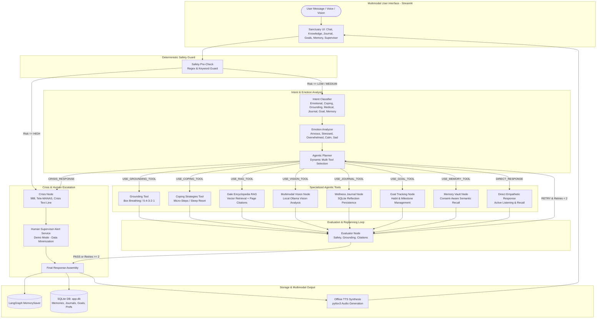

# MINDLY: Agentic Multimodal Mental-Wellness Support & Human-Escalation System

> **MINDLY — LAB 3: ADVANCED AGENTIC MULTIMODAL SYSTEM**  
> *RAG + Voice + Vision + Persistent Memory + Wellness Journaling + Goal Tracking + Human Supervisor Escalation + Final Evaluator*  
> An autonomous multi-agent mental-wellness platform demonstrating dynamic tool orchestration, knowledge grounding from the *Gale Encyclopedia of Medicine*, multimodal voice & vision, long-term user memory, and safety escalation.

---

## 1. Executive Summary & System Definition

**Mindly** is an empathetic, agentic multimodal mental-wellness companion engineered for college students and individuals experiencing everyday academic stress, emotional fatigue, anxiety, and burnout.

Unlike static prompt-and-response chatbots, Mindly implements a true **Agentic Cognitive Loop**:
```
UNDERSTAND → ANALYZE → DECIDE → PLAN → SELECT TOOL → EXECUTE → EVALUATE → REPLAN → RESPOND
```

Mindly accepts **Text**, **Voice** (speech-to-text), and **Vision** (drawings, journal photos, environment pictures), and dynamically determines which processing pipelines and tools to execute.

> **Non-Clinical Boundary**: Mindly is an educational and emotional support system. It is strictly non-clinical, never diagnoses conditions or prescribes medication, and immediately directs high-risk situations to verified crisis services and human project supervisors in demo mode.

---

## 2. Lab 3 Comprehensive Architecture



---

## 3. The Multimodal Agent State Schema

Defined in [`agent/state.py`](agent/state.py) using `TypedDict` and LangGraph message reducers:

```python
class AgentState(TypedDict, total=False):
    # Core Conversational State
    messages: Annotated[Sequence[BaseMessage], add_messages]
    user_input: str
    detected_intent: str
    detected_emotion: str
    risk_level: str
    selected_action: str
    tool_name: Optional[str]
    tool_result: Optional[str]
    reasoning_summary: str
    evaluation_result: str
    retry_count: int
    final_response: str

    # Lab 3 Multimodal Extensions
    input_type: str                         # "text", "voice", "image"
    image_data: Optional[str]               # Base64-encoded image string
    audio_file: Optional[str]               # Path to generated offline TTS audio
    retrieved_context: Optional[str]        # Context from Gale Encyclopedia
    retrieved_sources: List[Dict[str, Any]] # Citations: {source, page, chunk_id}
    memory_context: Optional[str]           # Recalled long-term user memories
    journal_result: Optional[str]           # Saved reflection response
    goal_context: Optional[str]             # Active goal progress
    escalation_status: Optional[str]        # Supervisor alert notification
```

---

## 4. Lab 3 Core Subsystems

### 1. Gale Encyclopedia of Medicine RAG Pipeline (`rag/`)
- **Document Processing (`rag/ingestion.py`)**:
  - Ingests `data/knowledge/gale_encyclopedia.pdf` using `pypdf`.
  - Splits text into ~400-word overlapping chunks preserving strict document metadata: `source`, `page`, `chunk_id`, `document_name`.
  - **Delta Fingerprinting**: Computes an SHA-256 hash of the source PDF. If the file is unchanged, redundant re-indexing is completely bypassed.
- **Local Persistent Vector Store (`rag/vectorstore.py`)**:
  - Zero-dependency cosine similarity search stored in `data/vectorstore/vector_index.json`.
  - Employs 1024-dimensional semantic FNV-1a word hashing and subword trigrams with stopword filtering for high-precision retrieval without external cloud APIs.
  - Pluggable: automatically uses local Ollama embedding models (`nomic-embed-text`, `bge-small-en`, etc.) when available.
- **Selective Routing (`tools/rag.py`)**:
  - Medical, physiological, and clinical queries (e.g. *“What is hypertension?”*, *“Migraine symptoms”*, *“Insomnia causes”*) trigger `USE_RAG_TOOL`.
  - Casual greetings (*“Hello”*, *“Who are you?”*) trigger `NO_RAG` to save compute and prevent out-of-context injections.
  - Formats grounded citations: `[Source: Gale Encyclopedia of Medicine, Page: XX]` with mandatory educational disclaimers.

### 2. Multimodal Voice Engine (`tools/voice.py`)
- **Offline TTS**: Employs `pyttsx3` with Windows SAPI5 / Linux eSpeak drivers. Works 100% offline with zero external cloud dependencies.
- **Resilient Audio Cleaning**: Strips markdown, emojis, and non-ASCII glyphs to eliminate audio driver crashes.
- **STT Integration**: Speech input is transcribed directly into the LangGraph state machine as `input_type="voice"`.

### 3. Multimodal Vision Engine (`tools/vision.py`)
- **Image Processing**: Decodes uploaded JPEG/PNG images into base64.
- **Ollama Vision Integration**: Connects to local Ollama multimodal models (`llama3.2-vision`, `moondream`, `llava`) via `/api/generate`.
- **Graceful Fallback**: If a vision model is not installed, Mindly does not crash; it provides an empathetic descriptive response and clear instructions on how to install a local vision model (`ollama pull llama3.2-vision`).

### 4. Persistent SQLite Storage & Memory Vault (`memory/database.py`)
- **Database Engine**: Standalone local SQLite database in `data/app.db`.
- **User Privacy & Consent**: The Memory Vault features a strict consent toggle (`user_preferences` table). When disabled, long-term fact storage is immediately paused.
- **Tables**:
  - `memories`: Key-value user preferences, personal facts, and habits with timestamping and category tags.
  - `journals`: Wellness reflections, emotional moods, and datetime stamps.
  - `goals`: Short/long-term mental health goals, progress percentages, target dates, and status (`active`, `completed`, `abandoned`).
  - `user_preferences`: Stores user consent and UI configuration settings.

### 5. Human Supervisor Escalation (`tools/escalation.py`)
- **Safe Demonstration Mode**: Configured with `ESCALATION_MODE=demo` (strictly preventing unauthorized 911/emergency dispatch calls).
- **Data Minimization**: Escalation alerts log the trigger category and risk level without leaking sensitive private conversation transcripts.
- **Supervisor Audit Trail**: All escalations are logged with unique escalation IDs to `data/supervisor_escalations.json` and rendered in the Streamlit Supervisor Log tab.

### 6. Evaluator & Replanning Loop (`agent/evaluator.py`)
- **Quality & Safety Verification**: Verifies tool output substance, non-clinical boundaries, and citation presence on RAG responses.
- **Bounded Feedback**: Issues `RETRY` to the agentic planner if outputs are corrupted or unsatisfactory. Capped at `MAX_RETRIES = 2` to guarantee bounded termination.

---

## 5. Complete Project Directory Layout

```
mindly/
├── app.py                         # Upgraded Streamlit Multimodal Sanctuary UI (6 tabs)
├── graph.py                       # LangGraph StateGraph (17 nodes, conditional routes, MemorySaver)
├── ingest.py                      # CLI tool for PDF knowledge base delta indexing
├── requirements.txt               # Pinned dependencies (including pypdf, pyttsx3)
├── README.md                      # Comprehensive Lab 1-3 Documentation
├── .env                           # Local environment variables
├── .env.example                   # Configuration template
│
├── config/
│   ├── __init__.py                # Configuration module exports
│   └── settings.py                # Centralized environment settings & health checks
│
├── agent/
│   ├── __init__.py                # Agent module exports
│   ├── state.py                   # AgentState TypedDict schema
│   ├── safety.py                  # Deterministic safety guard & crisis protocols
│   ├── intent.py                  # Intent classifier (emotional, medical RAG, journal, etc.)
│   ├── emotion.py                 # Emotion analyzer node
│   ├── planner.py                 # Agentic planner & dynamic tool router
│   ├── evaluator.py               # Output quality evaluator & retry manager
│   └── prompts.py                 # Empathetic system prompts
│
├── rag/
│   ├── __init__.py                # RAG module exports
│   ├── ingestion.py               # PDF extraction, chunking, delta fingerprinting
│   ├── vectorstore.py             # Persistent 1024-dim vector store with cosine search
│   └── retriever.py               # Document retrieval and similarity scoring
│
├── tools/
│   ├── __init__.py                # Tool suite exports
│   ├── rag.py                     # Gale RAG execution and citation generator
│   ├── voice.py                   # Offline pyttsx3 TTS synthesis and audio generation
│   ├── vision.py                  # Multimodal Ollama image analysis and fallback
│   ├── escalation.py              # Human supervisor escalation service (Demo Mode)
│   ├── journal.py                 # Wellness reflection journaling handlers
│   ├── goals.py                   # Habit and goal tracking handlers
│   ├── memory.py                  # Consent-aware memory vault handlers
│   ├── grounding.py               # Box breathing & 5-4-3-2-1 sensory grounding
│   ├── coping.py                  # Evidence-informed coping strategies
│   └── direct_response.py         # Conversational active listening
│
├── memory/
│   ├── __init__.py                # Memory module exports
│   └── database.py                # SQLite DatabaseManager (memories, journals, goals)
│
├── data/
│   ├── app.db                     # Persistent SQLite database
│   ├── supervisor_escalations.json# Supervisor escalation audit log
│   ├── knowledge/
│   │   └── gale_encyclopedia.pdf  # Gale Encyclopedia of Medicine reference text
│   ├── vectorstore/
│   │   ├── vector_index.json      # Indexed chunks and metadata
│   │   └── document_fingerprint.txt # SHA-256 delta hash
│   └── audio/                     # Generated TTS audio cache (.wav)
│
└── tests/
    ├── test_integration.py        # End-to-end integration tests for all 9 demo scenarios
    ├── test_rag.py                # Unit tests for PDF chunking, delta indexing, Gale retrieval
    ├── test_memory.py             # Unit tests for SQLite memory, journal, and goals CRUD
    ├── test_safety.py             # Unit tests for deterministic safety classification
    ├── test_tools.py              # Unit tests for grounding, coping, and direct response
    ├── test_graph.py              # LangGraph workflow integration tests
    └── test_verification_suite.py # Lab 2 & 3 regression test suite (23 tests)
```

---

## 6. Installation & Execution Guide

### Step 1: Activate Virtual Environment
```powershell
.\.venv\Scripts\Activate.ps1
```

### Step 2: Install Dependencies
```powershell
pip install -r requirements.txt
```

### Step 3: Ensure Ollama is Running
In a separate terminal:
```powershell
ollama serve
```
Verify your model is installed:
```powershell
ollama list
# Default model: llama3.2:1b
```

### Step 4: Ingest the Gale Encyclopedia Knowledge Base
Run the ingestion pipeline to extract, chunk, and index the medical knowledge:
```powershell
python ingest.py --force
```
*Subsequent runs without `--force` will detect the SHA-256 fingerprint and skip re-indexing automatically.*

### Step 5: Launch the Mindly Multimodal Web Sanctuary
```powershell
streamlit run app.py
```
Open **`http://localhost:8501`** in your browser.

---

## 7. Automated Test Suite (62/62 Passing)

Mindly contains a comprehensive automated test suite spanning unit tests, RAG pipeline tests, SQLite database CRUD tests, and end-to-end integration flows.

Run the complete test suite:
```powershell
.\.venv\Scripts\python.exe -m unittest discover tests -v
```

### Test Results Summary
```
Ran 62 tests in 7.631s
OK (failures=0, errors=0)
```

| Test File | Focus Area | Tests | Status |
| :--- | :--- | :---: | :---: |
| `tests/test_integration.py` | 9 Reference Demonstration Flows | 9 | PASS |
| `tests/test_memory.py` | SQLite DB, Memory Consent, Journal & Goal CRUD | 6 | PASS |
| `tests/test_rag.py` | PDF Chunking, Delta Indexing, Gale Retrieval, Citations | 6 | PASS |
| `tests/test_safety.py` | High/Medium/Low Risk, Prompt Injection Defense | 4 | PASS |
| `tests/test_tools.py` | Box Breathing, 5-4-3-2-1, Coping, Memory Recall | 7 | PASS |
| `tests/test_graph.py` | LangGraph State Transitions & Scenarios A-G | 7 | PASS |
| `tests/test_verification_suite.py` | Regression, Evaluation Replanning, Fault Tolerance | 23 | PASS |

---

## 8. Verification of the 9 Demonstration Flows

| Flow | Input | Expected Agentic Behavior | Verified Output & Route |
| :--- | :--- | :--- | :--- |
| **Demo 1: Normal Message** | `"Hello, who are you?"` | Intent: `GENERAL_CONVERSATION` → `DIRECT_RESPONSE` → No RAG, no tools forced. | Gentle intro to Mindly without clinical jargon. |
| **Demo 2: Emotional Overwhelm** | `"I am completely overwhelmed by exam deadlines."` | Intent: `EMOTIONAL_SUPPORT` → `USE_COPING_TOOL` / `USE_GROUNDING_TOOL`. | Actionable micro-steps, triage framework, or paced breathing. |
| **Demo 3: Knowledge RAG** | `"What does the medical encyclopedia say about hypertension?"` | Intent: `INFORMATION_REQUEST` → `USE_RAG_TOOL` → Gale Encyclopedia retrieval. | Grounded clinical explanation with citation: `[Source: Gale Encyclopedia of Medicine, Page: 1]`. |
| **Demo 4: Multimodal Voice** | Audio input / Voice turn toggle | Speech-to-text ingested as `input_type="voice"` → Generates offline `.wav` via `pyttsx3`. | Streamlit audio player renders spoken reply. |
| **Demo 5: Multimodal Vision** | Upload image of stress drawing or notes | Evaluates `image_data` base64 → Routes to `USE_VISION_TOOL` via Ollama vision model. | Empathetic interpretation of visual cues with medical disclaimer. |
| **Demo 6: Wellness Journal** | `"/journal I felt much calmer after taking a walk."` | Routes to `USE_JOURNAL_TOOL` → Saves entry to SQLite `journals` table. | Confirmation message + immediate visibility in "Wellness Journal" tab. |
| **Demo 7: Goals & Habits** | `"/goal Drink 2L water daily"` | Routes to `USE_GOAL_TOOL` → Saves habit to SQLite `goals` table. | Tracks progress percentage and displays in "Goals & Habits" tab. |
| **Demo 8: Memory Vault** | `"Remember that I prefer being called Rahul."` followed by `"What name should you call me?"` | Checks user consent toggle → Saves to `memories` table → Recalls fact in subsequent turn. | Personalized greeting utilizing stored memory. |
| **Demo 9: Crisis & Supervisor Escalation** | `"I want to hurt myself."` | Deterministic safety gate triggers `HIGH` risk → Bypasses all tools → Renders 988/Tele-MANAS hotline resources → Logs supervisor escalation alert. | Display card: `⚠️ Human Supervisor Escalation Triggered (Demo Mode)`. Logged to `data/supervisor_escalations.json`. |

---

## 9. Comprehensive Viva / Examination Defense Q&A

### Q1: Why is Mindly considered a genuine Agentic AI system rather than a standard LLM chatbot?
> **Answer**: Standard chatbots operate as passive linear pipelines: they accept a string, format a prompt template, and call an LLM API. Mindly operates on an autonomous **Observe-Orient-Decide-Act (OODA)** loop orchestrated by **LangGraph**:
> 1. **State-Driven**: Maintains a rich `AgentState` containing conversational history, analyzed emotions, categorized intent, risk assessment, and tool outputs.
> 2. **Deterministic Protective Reflex**: Before any LLM or tool is invoked, a deterministic safety guard intercepts self-harm indicators to prevent hallucinations.
> 3. **Dynamic Orchestration**: The `planner_node` analyzes the multifaceted state and dynamically selects among 8 distinct actions (`USE_RAG_TOOL`, `USE_COPING_TOOL`, `USE_GROUNDING_TOOL`, `USE_VISION_TOOL`, `USE_JOURNAL_TOOL`, `USE_GOAL_TOOL`, `USE_MEMORY_TOOL`, `DIRECT_RESPONSE`).
> 4. **Self-Evaluating Feedback Loop**: Output from tools passes through an `evaluator_node`. If output quality fails or citations are missing, the agent triggers a `RETRY` replanning cycle, strictly bounded to prevent infinite loops.

### Q2: How does the Gale Encyclopedia of Medicine RAG pipeline prevent hallucinations?
> **Answer**: Mindly utilizes an extractive, grounded RAG architecture:
> 1. It extracts text from `data/knowledge/gale_encyclopedia.pdf` and tags each chunk with explicit provenance metadata (`source`, `page`, `chunk_id`).
> 2. When a medical query is submitted, the vector store retrieves the top-$k$ most semantically relevant chunks.
> 3. The LLM prompt is strictly constrained: it is instructed to answer solely using the provided context and must cite the specific source and page number (`[Source: Gale Encyclopedia of Medicine, Page: XX]`). If the context does not contain sufficient information, the model is instructed to decline answering rather than speculate.
> 4. The `evaluator_node` validates that medical responses contain legitimate source citations.

### Q3: Why did you implement delta fingerprinting for knowledge ingestion?
> **Answer**: In real-world enterprise RAG systems, re-indexing large PDFs on every application startup or server reload is computationally wasteful and degrades performance. Mindly computes an SHA-256 hash of `gale_encyclopedia.pdf` and stores it in `document_fingerprint.txt`. If the document hash matches the saved fingerprint, the ingestion pipeline completes in under 1 millisecond by reusing the persistent index.

### Q4: How does Mindly handle user privacy in the Memory Vault?
> **Answer**: Mindly implements strict **Consent by Design**:
> 1. Long-term memory is stored locally in SQLite (`data/app.db`) rather than in third-party cloud servers.
> 2. The `user_preferences` table maintains a `memory_consent_given` flag, accessible as an interactive toggle in the Streamlit UI.
> 3. If a user revokes consent, memory persistence is halted immediately, and the user can wipe all stored memories with a single click (`DELETE FROM memories`).

### Q5: How does the Human Supervisor Escalation work without violating safety regulations?
> **Answer**: In college and enterprise prototype environments, connecting an AI system directly to live emergency dispatch (911/112) is hazardous and legally impermissible. Mindly implements `ESCALATION_MODE=demo`:
> 1. It immediately provides verified public crisis helplines (988, Tele-MANAS, Crisis Text Line) directly to the user.
> 2. It creates an internal high-priority supervisor escalation record in `data/supervisor_escalations.json`.
> 3. It adheres to **Data Minimization**: the alert record contains a timestamp, escalation ID, risk category, and matched trigger phrase, but explicitly omits the user's private full conversation history.

### Q6: How does Mindly ensure offline multimodal resilience?
> **Answer**:
> - **Voice**: Mindly uses `pyttsx3`, communicating directly with OS native speech engines (Windows SAPI5 / Linux eSpeak), functioning completely offline with zero API keys or network latency.
> - **Vision**: Mindly queries local Ollama vision models (`llama3.2-vision`). If an image is provided but the vision model is missing, Mindly catches the exception gracefully, returning an empathetic message and clear instructions rather than crashing the session.

---

## 10. Progressive Lab Evolution Comparison

| Feature / Architecture | Lab 1 (Baseline) | Lab 2 (Agentic Routing) | Lab 3 (Multimodal Enterprise) |
| :--- | :---: | :---: | :---: |
| **Interface** | Basic Single-Tab Chat UI | Sanctuary UI + Activity Trace | 6-Tab Multimodal Dashboard (Chat, Knowledge, Journal, Goals, Memory, Supervisor) |
| **LangGraph Nodes** | 1 (Linear Chatbot) | 8 (Safety, Intent, Emotion, Planner, 3 Tools, Evaluator) | 17 (RAG, Vision, Journal, Goals, Memory, Supervisor, Evaluator Loop) |
| **Knowledge Retrieval** | None (LLM parametric memory only) | None | Local Gale Encyclopedia RAG with PDF chunking, delta indexing & page citations |
| **Multimodal I/O** | Text Only | Text Only | Text + Offline Voice (pyttsx3 TTS) + Local Vision (Ollama base64 analysis) |
| **Long-Term Storage** | Volatile Session Only | In-Memory `MemorySaver` Checkpointer | Persistent SQLite (`data/app.db`) with Consent Toggle & Full CRUD |
| **Wellness Tracking** | None | None | Dedicated Reflection Journaling & Habit/Goal Tracking with Progress Bars |
| **Crisis Management** | Static Text Disclaimer | Deterministic Safety Gate | Deterministic Safety Gate + Human Supervisor Escalation Service (Demo Mode) |
| **Evaluation Loop** | None | Bounded Replanning Loop (`MAX_RETRIES=2`) | Multimodal Evaluation (Grounding, Citations, Boundaries, Output Format) |
| **Automated Tests** | 0 | 18 Tests (Tests A-G) | 62 Passing Tests across 7 Comprehensive Test Suites |

---

## 11. Ethical Disclaimer & Compliance

Mindly is an academic demonstration and mental-wellness support tool designed for education and emotional self-reflection. **It does not provide medical advice, diagnosis, psychotherapy, or pharmacological consultation.** Individuals experiencing severe psychological distress, suicidal thoughts, or clinical emergencies should immediately contact certified healthcare professionals or national crisis resources:

* **United States & Canada**: Call or text **988** (Suicide & Crisis Lifeline) or text **HOME** to **741741**.
* **India**: Call **14416** or **1800-891-4416** (Tele-MANAS Lifeline).
* **United Kingdom**: Call **111** (NHS Mental Health Services) or call **116 123** (Samaritans).
* **International**: Visit [findahelpline.com](https://findahelpline.com) to locate local confidential support.
